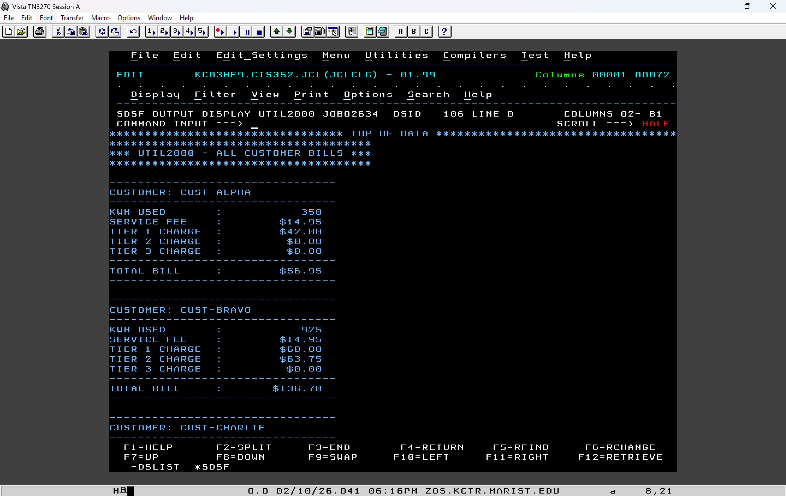
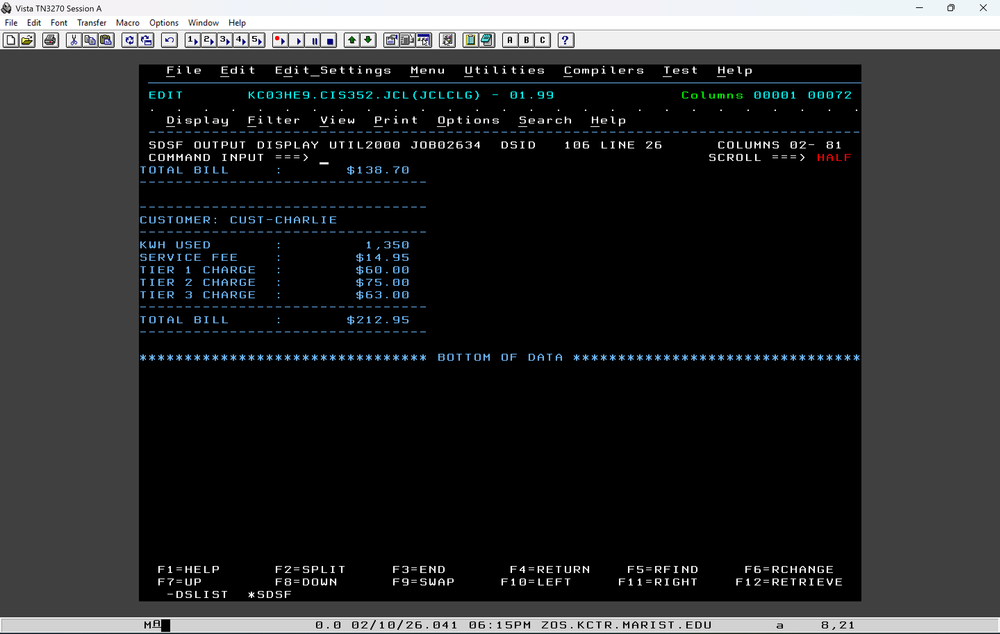

# UTIL2000 (COBOL) - Electric Bill Calculator
<b>Table of Contents</b>
- [Summary](#summary)
- [Screenshots](#screenshots)
  - [Output](#output)
- [Topics Covered](#topics-covered)
- [Maintainers](#maintainers)

## Summary
### Welcome to the Electric Bill Calculator!
This COBOL program is used to caculate the total electric bill for 3 customers based on pre-defined KWH used and a 3-tiered charging system. 
 
For every run, the program will:
  1. Initialize program variables to a starting value of 0
  2. Load each customer and their electricity use information one a time
  3. Calculate the customer's bill based on what tier of electricity they used
  4. Output the results into a final summary report for all 3 customers

For full program details, see [Program Requirements](assets/AssignmentRequirements.pdf)
## Screenshots

### Output

## Topics Covered
1. Developing COBOL programs for the mainframe environment
2. Variables and arithmetic
3. Loops
4. Formatted output generation
5. Division Structure
6. MOVE, COMPUTE, DISPLAY, UNTIL statements
7. ** Program was build entirely in the mainframe without IDE support **

## Maintainers
[@bstearns07](https://github.com/bstearns07) Ben Stearns

[Back to Top](#top)
